# Agentic Kubernetes Operator Demo

This repository provides the complete environment to demonstrate an AI-based agentic operator managing a Kubernetes cluster. The system uses Kind (Kubernetes in Docker) to simulate a multi-node environment, injects failures using chaos engineering principles, and visualizes the AI agents' response in real-time.

## 🏛️ System Architecture Overview

The architecture is designed with clear separation of concerns: the **Frontend Dashboard** (our window into the system), the **Backend Coordination Script** (non-agentic demo control and chaos injection), the **AI Agent Swarm** (autonomous healing system), and the **Kubernetes Cluster** (the environment being managed). 

**Key Principle**: The coordination script creates problems through scripted chaos injection, the AI agents solve them autonomously - simulating real-world scenarios where external issues occur and intelligent systems respond without human intervention.

### Level 1: High-Level System Components

This diagram shows the primary components and their basic relationships. The user interacts with the UI, which is powered by a simple FastAPI server. The coordination script is non-agentic - it just executes predefined chaos scenarios and coordinates the demo flow, while the AI agents autonomously monitor and heal the cluster.

```mermaid
graph TB
    subgraph "Frontend Layer"
        UI["📈 React Dashboard"]
    end

    subgraph "Backend Layer"
        Orchestrator["🐍 FastAPI Server<br/>Non-Agentic Script<br/>Demo Control & Chaos Injection"]
    end

    subgraph "Agent Layer"
        Swarm["🤖 AI Agent Swarm<br/>Autonomous Healing System"]
    end

    subgraph "Infrastructure Layer"
        K8s["☸️ Kubernetes Cluster<br/>(Kind)"]
    end

    UI <-->|WebSocket Stream| Orchestrator
    Orchestrator -.->|Task Assignment| Swarm
    Swarm <-->|Monitor & Heal| K8s
    Orchestrator -->|Chaos Injection| K8s

    classDef frontend fill:#d3e5ef,stroke:#333,stroke-width:2px
    classDef backend fill:#e5f5e0,stroke:#333,stroke-width:2px
    classDef agent fill:#f9d5e5,stroke:#333,stroke-width:2px
    classDef infra fill:#fcf3cf,stroke:#333,stroke-width:2px

    class UI frontend
    class Orchestrator backend
    class Swarm agent
    class K8s infra
```



### Level 2: Agent & Cluster Interaction Workflow

This level details the workflow with **clear separation of concerns**. The **Backend Coordination Script** is a simple, non-agentic script that manages the demo flow and injects predefined failures for testing, while the **AI Agents** act as the autonomous healing system. The script creates problems through basic automation, and the agents solve them intelligently - just like they would in a real production environment where they don't know about the source of failures.

```mermaid
graph LR
    subgraph "Frontend"
        UI["📈 React Dashboard"]
    end

    subgraph "Backend Coordination Script"
        Orchestrator["🐍 FastAPI Server (Non-Agentic)"]
        ChaosEngine["💥 Chaos Engine (Scripted Failures)"]
    end

    subgraph "Agent Layer"
        Agent["🤖 AI Agent (Autonomous Healer)"]
    end

    subgraph "Kubernetes Environment"
       K8sAPI["☸️ K8s API Server"]
       ClusterNodes["Nodes & Pods"]
    end

    subgraph "Tooling"
        Tools["kubectl, k8sgpt, etc."]
    end

    UI <-.->|WebSocket Stream| Orchestrator
    
    %% Non-agentic script manages demo and chaos
    Orchestrator --> ChaosEngine
    ChaosEngine -- "Executes Scripted Failure" --> K8sAPI
    
    %% AI Agent operates independently 
    Agent -- "Detects Issues" --> Tools
    Agent -- "Analyzes with AI" --> Tools
    Tools -- "Queries cluster state" --> K8sAPI
    K8sAPI -- "Returns cluster state" --> Tools
    Tools -- "Returns diagnosis" --> Agent
    
    Agent -- "Executes Healing" --> Tools
    Agent -- "Streams Status/Actions" --> Orchestrator

    K8sAPI -- "State Changes" --> ClusterNodes

    classDef ui fill:#d3e5ef,stroke:#333,stroke-width:1px
    classDef backend fill:#e5f5e0,stroke:#333,stroke-width:1px
    classDef chaos fill:#ffcccb,stroke:#333,stroke-width:1px
    classDef agent fill:#f9d5e5,stroke:#333,stroke-width:1px
    classDef k8s fill:#fcf3cf,stroke:#333,stroke-width:1px
    classDef tools fill:#eeeeee,stroke:#333,stroke-width:1px

    class UI ui
    class Orchestrator backend
    class ChaosEngine chaos
    class Agent agent
    class K8sAPI,ClusterNodes k8s
    class Tools tools
```



### Level 3: Data Endpoints for Frontend Dashboard

This diagram focuses specifically on the data contract between the backend and the frontend. The dashboard is a "dumb" client that renders state provided by the FastAPI server. Communication is primarily handled via WebSockets for real-time updates, with auxiliary data fetched via standard REST APIs.


## 🔄 Autonomous Investigation & Report Flow

The system includes an autonomous monitoring and investigation pipeline that detects issues and generates detailed reports:

### Investigation Trigger Flow

```mermaid
flowchart TD
    A[🔍 Autonomous Monitor] --> B[🚨 Issue Detection]
    B --> C[🤖 Deterministic Investigator]
    C --> D[📊 Cluster Analysis]
    D --> E[📝 Report Generator]
    E --> F[💾 File Storage]
    F --> G[🌐 Frontend Access]
    
    classDef monitor fill:#f9d5e5,stroke:#333,stroke-width:3px,font-size:16px
    classDef investigator fill:#e5f5e0,stroke:#333,stroke-width:3px,font-size:16px
    classDef storage fill:#fcf3cf,stroke:#333,stroke-width:3px,font-size:16px
    classDef frontend fill:#d3e5ef,stroke:#333,stroke-width:3px,font-size:16px
    classDef process fill:#f0f0f0,stroke:#333,stroke-width:2px,font-size:16px
    
    class A monitor
    class C investigator
    class F storage
    class G frontend
    class B,D,E process
```



This vertical flow is much more intuitive for showing the sequential steps of the investigation process, making it easier to follow the pipeline from issue detection all the way to frontend access! 🎯

### Report Generation Process

1. **🔍 Autonomous Monitor** continuously watches Kubernetes cluster health
   - Detects pod failures, node issues, resource problems
   - Monitors every 1 second for real-time response

2. **🚨 Issue Detection** triggers when problems are found
   - CrashLoopBackOff pods
   - ImagePullBackOff errors  
   - Node status problems
   - Resource exhaustion

3. **🤖 Investigation Launch** calls DeterministicInvestigator
   - Runs systematic cluster analysis
   - Collects logs, events, and resource metrics
   - Analyzes workloads and network configuration

4. **📊 Data Collection & Analysis**
   - Node health assessment
   - Pod status evaluation  
   - Resource utilization analysis
   - Event timeline review
   - k8sgpt AI-powered diagnostics

5. **📝 Report Generation** creates structured findings
   - Executive summary with severity levels
   - Detailed findings by category
   - Actionable recommendations
   - Investigation steps executed

6. **💾 File Storage** saves timestamped reports
   - Location: `/root/reports/autonomous_report_YYYYMMDD_HHMMSS.txt`
   - Human-readable text format
   - Includes all findings and recommendations

7. **🌐 Frontend Access** via REST API
   - Endpoint: `GET /api/agents/reports/{filename}`
   - Clickable links in live log stream
   - Real-time report notifications

### Report Content Structure

Each investigation report includes:

- **🎯 Executive Summary** - High-level cluster health status
- **🚨 Critical Issues** - Immediate attention required  
- **⚠️ High Priority Issues** - Schedule for resolution
- **📋 All Findings by Category** - Comprehensive issue breakdown
- **📊 Investigation Steps** - What was analyzed and when
- **💡 Recommendations** - Prioritized action items
- **🔗 Next Actions** - Suggested follow-up steps

## 🏗️ Kubernetes Cluster Architecture

The demo cluster includes:
- **1 Control Plane Node** with ingress capabilities
- **4 Worker Nodes** with different labels and roles:
  - Frontend tier (zone: us-west-1a)
  - Backend tier (zone: us-west-1b) 
  - Database tier (zone: us-west-1c)
  - Cache tier (zone: us-west-1a)

## 📋 Prerequisites

Before running this demo, ensure you have the following installed:

### Docker
- [Docker](https://docs.docker.com/get-docker/) - Must be running

### Kind (Kubernetes in Docker)

**macOS:**
```bash
brew install kind
```

**Linux:**
```bash
# For AMD64 / x86_64
[ $(uname -m) = x86_64 ] && curl -Lo ./kind https://kind.sigs.k8s.io/dl/v0.20.0/kind-linux-amd64
# For ARM64
[ $(uname -m) = aarch64 ] && curl -Lo ./kind https://kind.sigs.k8s.io/dl/v0.20.0/kind-linux-arm64
chmod +x ./kind
sudo mv ./kind /usr/local/bin/kind
```

**Windows:**
```powershell
# Using Chocolatey
choco install kind

# Or download binary directly
curl.exe -Lo kind-windows-amd64.exe https://kind.sigs.k8s.io/dl/v0.20.0/kind-windows-amd64
Move-Item .\kind-windows-amd64.exe c:\some-dir-in-your-PATH\kind.exe
```

### kubectl

**macOS:**
```bash
brew install kubectl
```

**Linux:**
```bash
curl -LO "https://dl.k8s.io/release/$(curl -L -s https://dl.k8s.io/release/stable.txt)/bin/linux/amd64/kubectl"
chmod +x kubectl
sudo mv kubectl /usr/local/bin/
```

**Windows:**
```powershell
# Using Chocolatey
choco install kubernetes-cli

# Or using PowerShell
curl.exe -LO "https://dl.k8s.io/release/v1.28.0/bin/windows/amd64/kubectl.exe"
# Move kubectl.exe to a directory in your PATH
```

## 🚀 Quick Start

### Single Command Setup
```bash
./start-fullstack.sh
```

This **one command** handles everything:
- ✅ **Builds development container** with all tools (kubectl, k8sgpt, Python, etc.)
- ✅ **Starts backend services** (FastAPI + Autonomous Monitor) in container
- ✅ **Installs frontend dependencies** (if needed)
- ✅ **Starts React frontend** with hot reload
- ✅ **Sets up networking** with automatic proxying

### What You Get

**🌐 Frontend Dashboard**: http://localhost:3000
- Live log streaming from autonomous agents
- Real-time cluster health monitoring
- Investigation reports with clickable links

**🔧 Backend API**: http://localhost:8000
- Autonomous Kubernetes monitoring (every 1 second)
- AI-powered investigation agents
- Google ADK integration for intelligent analysis

**📚 API Documentation**: http://localhost:8000/docs
- Interactive Swagger UI
- Test all endpoints directly

### Prerequisites Setup (Optional)

If you want to set up your own Kubernetes cluster for testing:

```bash
# 1. Create demo cluster with chaos apps
chmod +x setup-cluster.sh && ./setup-cluster.sh

# 2. Deploy applications with intentional failures
chmod +x deploy-demo-apps.sh && ./deploy-demo-apps.sh

# 3. Run chaos scenarios (optional)
chmod +x chaos-scenarios.sh && ./chaos-scenarios.sh
```

**Note**: The full stack application will work with any accessible Kubernetes cluster - it doesn't require the demo cluster setup.

## 🧹 Cleanup

To remove the entire cluster and clean up resources:
```bash
chmod +x cleanup.sh
./cleanup.sh
```

## 📊 Monitoring Commands

```bash
# View cluster status
kubectl get nodes -o wide
kubectl get pods --all-namespaces

# Monitor resource usage
kubectl top nodes
kubectl top pods --all-namespaces

# Check autoscaling
kubectl get hpa --all-namespaces

# View services
kubectl get services --all-namespaces

# Check ingress
kubectl get ingress --all-namespaces
```

## 🎯 Demo Scenarios

### Basic Pod Resilience
1. Kill frontend pods and watch them recover
2. Scale applications up/down
3. Observe HPA behavior under load

### Node Failure Simulation
1. Drain a worker node
2. Watch pods reschedule to healthy nodes
3. Demonstrate node recovery

### Resource Exhaustion
1. Create CPU/Memory pressure
2. Observe pod evictions
3. Watch cluster auto-scaling responses

### Network Issues
1. Apply network policies
2. Simulate network partitions
3. Demonstrate service mesh behavior

### Storage Failures
1. Scale down StatefulSets
2. Simulate persistent volume issues
3. Test backup/recovery procedures

## 🔧 Customization

### Modify Cluster Configuration
Edit `kind-cluster-config.yaml` to:
- Add more nodes
- Change node labels
- Modify networking settings
- Add custom port mappings

### Add More Applications
Extend `deploy-demo-apps.sh` to include:
- Additional microservices
- Different database types
- Monitoring stack (Prometheus, Grafana)
- Service mesh (Istio, Linkerd)

### Create Custom Chaos Scenarios
Modify `chaos-scenarios.sh` to add:
- Custom failure patterns
- Specific application failures
- Time-based scenarios
- Automated recovery procedures

## 📁 Key Components

```
├── start-fullstack.sh         # 🚀 Single command to start everything
├── run-streaming-stack.sh     # Backend services orchestration
├── Dockerfile                 # Development container definition
├── Makefile                   # Build and container management
├── frontend/                  # React dashboard with live monitoring
├── backend/                   # FastAPI server with Google ADK integration
├── api/                       # Autonomous monitoring and investigation agents
├── reports/                   # Generated investigation reports
├── setup-cluster.sh           # Optional: Create demo Kubernetes cluster
├── deploy-demo-apps.sh        # Optional: Deploy test applications
└── chaos-scenarios.sh         # Optional: Chaos engineering scenarios
```

## 🤝 Sharing and Replication

This entire setup is designed to be easily shared and replicated:

1. **Clone this repository**
2. **Ensure Docker is running**
3. **Run the full stack** - `./start-fullstack.sh`

The containerized approach ensures consistent environments across different machines and users. No complex setup required!

## 🐛 Troubleshooting

### Common Issues

**Docker not running:**
```bash
# Start Docker Desktop or Docker daemon
open -a Docker
```

**Kind cluster creation fails:**
```bash
# Check Docker resources and try again
kind delete cluster --name=demo-cluster
./setup-cluster.sh
```

**Pods stuck in Pending:**
```bash
# Check node resources and events
kubectl describe nodes
kubectl get events --sort-by=.metadata.creationTimestamp
```

**Metrics not available:**
```bash
# Wait for metrics server to be ready
kubectl get pods -n kube-system | grep metrics-server
```

## 📚 Learning Resources

- [Kind Documentation](https://kind.sigs.k8s.io/)
- [Kubernetes Documentation](https://kubernetes.io/docs/)
- [Chaos Engineering Principles](https://principlesofchaos.org/)
- [kubectl Cheat Sheet](https://kubernetes.io/docs/reference/kubectl/cheatsheet/)

## 🎉 Happy Demoing!

This environment provides a realistic Kubernetes setup for demonstrating resilience patterns, failure scenarios, and recovery procedures. Perfect for training, workshops, and proof-of-concepts.
