# Agentic Kubernetes Operator Demo

This repository provides the complete environment to demonstrate an AI-based agentic operator managing a Kubernetes cluster. The system uses Kind (Kubernetes in Docker) to simulate a multi-node environment, injects failures using chaos engineering principles, and visualizes the AI agents' response in real-time.

## 🚀 Quick Start - Complete Demo in 4 Commands

### Prerequisites
```bash
# Set up environment variables in .env file:
OPENROUTER_API_KEY=<your-key-here>
AGENT_SAFE_MODE=false
AGENT_AUTO_INVESTIGATE=true
AGENT_CHECK_INTERVAL=30
```

### 1. Setup & Deploy (Clean Start)
```bash
make setup-cluster && make deploy-demo-apps && make start-fullstack
```
**What this does:**
- Creates 5-node Kubernetes cluster
- Deploys healthy applications only
- Starts AI monitoring system
- Opens frontend at http://localhost:3000

### 2. Create Chaos (On-Demand)
```bash
# Interactive menu with 8 scenarios
make chaos

# Or direct commands:
make chaos-images    # Deploy ImagePullBackOff pods
make chaos-crashes   # Deploy CrashLoopBackOff pods  
make chaos-pods      # Delete healthy pods (auto-recreate)
```

### 3. Watch AI Response
- **Frontend**: Real-time AI investigations at http://localhost:3000
- **Reports**: Detailed analysis in `reports/` directory
- **Enhanced Reasoning**: Company knowledge integration

### 4. Cleanup
```bash
make clean
```
**Complete shutdown:** Removes containers, cluster, and reclaims disk space.

## 🔥 Available Chaos Scenarios

| Command | Effect | AI Detects |
|---------|--------|------------|
| `make chaos-images` | Deploy broken images | ImagePullBackOff |
| `make chaos-crashes` | Deploy failing apps | CrashLoopBackOff |
| `make chaos-pods` | Delete healthy pods | Pod recreation events |
| `make chaos-recovery` | Fix all issues | Recovery validation |

## 🎪 Perfect Demo Flow

```bash
# 1. Clean, healthy start
make setup-cluster && make deploy-demo-apps && make start-fullstack

# 2. Create chaos on-demand (while AI is watching!)
make chaos-images    # Watch AI detect ImagePullBackOff
make chaos-crashes   # Watch AI detect CrashLoopBackOff  

# 3. Demonstrate recovery
make chaos-recovery  # Show AI recommendations being applied

# 4. Clean shutdown
make clean
```

## 🏛️ System Architecture Overview

The architecture is designed with clear separation of concerns: the **Frontend Dashboard** (our window into the system), the **Backend Coordination Script** (non-agentic demo control and chaos injection), the **AI Agent Swarm** (autonomous healing system), and the **Kubernetes Cluster** (the environment being managed). 

**Key Principle**: The coordination script creates problems through scripted chaos injection, the AI agents solve them autonomously - simulating real-world scenarios where external issues occur and intelligent systems respond without human intervention.

### Level 1: High-Level System Components

This diagram shows the primary components and their basic relationships. The user interacts with the UI, which is powered by a simple FastAPI server. The coordination script is non-agentic - it just executes predefined chaos scenarios and coordinates the demo flow, while the AI agents autonomously monitor and heal the cluster.

```mermaid
graph TB
    subgraph "Frontend Layer"
        UI["📈 React Dashboard"]
    end

    subgraph "Backend Layer"
        Orchestrator["🐍 FastAPI Server<br/>Non-Agentic Script<br/>Demo Control & Chaos Injection"]
    end

    subgraph "Agent Layer"
        Swarm["🤖 AI Agent Swarm<br/>Autonomous Healing System"]
    end

    subgraph "Infrastructure Layer"
        K8s["☸️ Kubernetes Cluster<br/>(Kind)"]
    end

    UI <-->|WebSocket Stream| Orchestrator
    Orchestrator -.->|Task Assignment| Swarm
    Swarm <-->|Monitor & Heal| K8s
    Orchestrator -->|Chaos Injection| K8s

    classDef frontend fill:#d3e5ef,stroke:#333,stroke-width:2px
    classDef backend fill:#e5f5e0,stroke:#333,stroke-width:2px
    classDef agent fill:#f9d5e5,stroke:#333,stroke-width:2px
    classDef infra fill:#fcf3cf,stroke:#333,stroke-width:2px

    class UI frontend
    class Orchestrator backend
    class Swarm agent
    class K8s infra
```



### Level 2: Agent & Cluster Interaction Workflow

This level details the workflow with **clear separation of concerns**. The **Backend Coordination Script** is a simple, non-agentic script that manages the demo flow and injects predefined failures for testing, while the **AI Agents** act as the autonomous healing system. The script creates problems through basic automation, and the agents solve them intelligently - just like they would in a real production environment where they don't know about the source of failures.

```mermaid
graph LR
    subgraph "Frontend"
        UI["📈 React Dashboard"]
    end

    subgraph "Backend Coordination Script"
        Orchestrator["🐍 FastAPI Server (Non-Agentic)"]
        ChaosEngine["💥 Chaos Engine (Scripted Failures)"]
    end

    subgraph "Agent Layer"
        Agent["🤖 AI Agent (Autonomous Healer)"]
    end

    subgraph "Kubernetes Environment"
       K8sAPI["☸️ K8s API Server"]
       ClusterNodes["Nodes & Pods"]
    end

    subgraph "Tooling"
        Tools["kubectl, k8sgpt, etc."]
    end

    UI <-.->|WebSocket Stream| Orchestrator
    
    %% Non-agentic script manages demo and chaos
    Orchestrator --> ChaosEngine
    ChaosEngine -- "Executes Scripted Failure" --> K8sAPI
    
    %% AI Agent operates independently 
    Agent -- "Detects Issues" --> Tools
    Agent -- "Analyzes with AI" --> Tools
    Tools -- "Queries cluster state" --> K8sAPI
    K8sAPI -- "Returns cluster state" --> Tools
    Tools -- "Returns diagnosis" --> Agent
    
    Agent -- "Executes Healing" --> Tools
    Agent -- "Streams Status/Actions" --> Orchestrator

    K8sAPI -- "State Changes" --> ClusterNodes

    classDef ui fill:#d3e5ef,stroke:#333,stroke-width:1px
    classDef backend fill:#e5f5e0,stroke:#333,stroke-width:1px
    classDef chaos fill:#ffcccb,stroke:#333,stroke-width:1px
    classDef agent fill:#f9d5e5,stroke:#333,stroke-width:1px
    classDef k8s fill:#fcf3cf,stroke:#333,stroke-width:1px
    classDef tools fill:#eeeeee,stroke:#333,stroke-width:1px

    class UI ui
    class Orchestrator backend
    class ChaosEngine chaos
    class Agent agent
    class K8sAPI,ClusterNodes k8s
    class Tools tools
```



### Level 3: Data Endpoints for Frontend Dashboard

This diagram focuses specifically on the data contract between the backend and the frontend. The dashboard is a "dumb" client that renders state provided by the FastAPI server. Communication is primarily handled via WebSockets for real-time updates, with auxiliary data fetched via standard REST APIs.

```mermaid
graph TD
    subgraph "Frontend Components"
        A["📊 Agent Status Grid"]
        B["📋 Live Log Stream"]
        C["🌐 Cluster View (kube-ops-view style)"]
        D["📈 Metrics Panel"]
    end

    subgraph "Backend Data Sources"
        E["FastAPI Server"]
    end

    subgraph "WebSocket Channels"
        WS1["/ws/agent-status"]
        WS2["/ws/cluster-events"]
        WS3["/ws/global-metrics"]
    end

    subgraph "REST Endpoints"
        R1["GET /api/agents/history"]
        R2["POST /api/chaos/inject"]
        R3["GET /api/cluster/snapshot"]
        R4["POST /api/investigations/deterministic"]
        R5["POST /api/investigations/agentic"]
        R6["GET /api/monitoring/status"]
    end

    E -->|Pushes Agent Updates| WS1 --> A
    E -->|Streams Logs & Events| WS2 --> B
    E -->|Pushes Metrics| WS3 --> D

    A -->|Fetch historical logs| R1
    C -->|Get initial state| R3
    A -->|User Action: Inject Failure| R2
    A -->|User Action: Start Investigation| R4
    A -->|User Action: Start AI Investigation| R5
    D -->|Check Monitor Status| R6

    R1 --> E
    R2 --> E
    R3 --> E
    R4 --> E
    R5 --> E
    R6 --> E

    classDef frontend fill:#d3e5ef,stroke:#333,stroke-width:1px
    classDef backend fill:#e5f5e0,stroke:#333,stroke-width:1px
    classDef ws fill:#f9d5e5,stroke:#333,stroke-width:1px,stroke-dasharray: 5 5
    classDef rest fill:#fcf3cf,stroke:#333,stroke-width:1px,stroke-dasharray: 5 5

    class A,B,C,D frontend
    class E backend
    class WS1,WS2,WS3 ws
    class R1,R2,R3 rest
```



## 🏗️ Unified Backend Architecture

The system has been consolidated into a single, unified backend structure for simplicity and maintainability:

### **📡 `backend/` - Complete Application Layer**
**Purpose:** Single FastAPI application that handles all functionality

**Responsibilities:**
- 🌐 **HTTP REST API** endpoints (`/api/agents`, `/api/cluster`, `/api/investigations`, etc.)
- 🔌 **WebSocket connections** for real-time streaming
- 🤖 **Autonomous monitoring** and investigation agents
- 🚨 **Issue detection** (CrashLoopBackOff, ImagePullBackOff, etc.)
- 📝 **Report generation** and file writing
- 🛠️ **kubectl/k8sgpt wrapper tools**
- 🎯 **Request routing** and response formatting
- 🔧 **CORS middleware** for frontend integration


### **🔄 How It Works**


### **🎯 Benefits of Unified Architecture**

**✅ Simplified:**
- Single FastAPI application instead of multiple services
- Consistent import paths and configuration
- Container-first development workflow

**✅ Maintainable:**
- All functionality in one place
- No duplicate API implementations
- Unified error handling and logging

**✅ Scalable:**
- Clean separation between API endpoints, agents, and services
- Easy to add new investigation types or monitoring features

## 🔄 Autonomous Investigation & Report Flow

The system includes an autonomous monitoring and investigation pipeline that detects issues and generates detailed reports:

### Investigation Trigger Flow

```mermaid
flowchart TD
    A[🔍 Autonomous Monitor] --> B[🚨 Issue Detection]
    API["📡 REST API Trigger"] --> B
    B --> C[🤖 Deterministic Investigator]
    B --> C2[🤖 Agentic Investigator]
    C --> D[📊 Cluster Analysis]
    C2 --> D2[📊 AI-Driven Analysis]
    D --> E[📝 Report Generator]
    D2 --> E
    E --> F[💾 File Storage]
    F --> G[🌐 Frontend Access]
    
    classDef monitor fill:#f9d5e5,stroke:#333,stroke-width:3px,font-size:16px
    classDef investigator fill:#e5f5e0,stroke:#333,stroke-width:3px,font-size:16px
    classDef storage fill:#fcf3cf,stroke:#333,stroke-width:3px,font-size:16px
    classDef frontend fill:#d3e5ef,stroke:#333,stroke-width:3px,font-size:16px
    classDef process fill:#f0f0f0,stroke:#333,stroke-width:2px,font-size:16px
    classDef api fill:#e6f3ff,stroke:#333,stroke-width:3px,font-size:16px
    
    class A monitor
    class C,C2 investigator
    class F storage
    class G frontend
    class B,D,D2,E process
    class API api
```



This vertical flow is much more intuitive for showing the sequential steps of the investigation process, making it easier to follow the pipeline from issue detection all the way to frontend access! 🎯

### Report Generation Process

1. **🔍 Autonomous Monitor** continuously watches Kubernetes cluster health
   - Detects pod failures, node issues, resource problems
   - Monitors every 1 second for real-time response

2. **🚨 Issue Detection** triggers when problems are found
   - CrashLoopBackOff pods
   - ImagePullBackOff errors  
   - Node status problems
   - Resource exhaustion

3. **🤖 Investigation Launch** calls DeterministicInvestigator
   - Runs systematic cluster analysis
   - Collects logs, events, and resource metrics
   - Analyzes workloads and network configuration

4. **📊 Data Collection & Analysis**
   - Node health assessment
   - Pod status evaluation  
   - Resource utilization analysis
   - Event timeline review
   - k8sgpt AI-powered diagnostics

5. **📝 Report Generation** creates structured findings
   - Executive summary with severity levels
   - Detailed findings by category
   - Actionable recommendations
   - Investigation steps executed

6. **💾 File Storage** saves timestamped reports
   - Location: `/root/reports/autonomous_report_YYYYMMDD_HHMMSS.txt`
   - Human-readable text format
   - Includes all findings and recommendations

7. **🌐 Frontend Access** via REST API
   - Endpoint: `GET /api/agents/reports/{filename}`
   - Clickable links in live log stream
   - Real-time report notifications

### Report Content Structure

Each investigation report includes:

- **🎯 Executive Summary** - High-level cluster health status
- **🚨 Critical Issues** - Immediate attention required  
- **⚠️ High Priority Issues** - Schedule for resolution
- **📋 All Findings by Category** - Comprehensive issue breakdown
- **📊 Investigation Steps** - What was analyzed and when
- **💡 Recommendations** - Prioritized action items
- **🔗 Next Actions** - Suggested follow-up steps

## 🏗️ Kubernetes Cluster Architecture

The demo cluster includes:
- **1 Control Plane Node** with ingress capabilities
- **4 Worker Nodes** with different labels and roles:
  - Frontend tier (zone: us-west-1a)
  - Backend tier (zone: us-west-1b) 
  - Database tier (zone: us-west-1c)
  - Cache tier (zone: us-west-1a)

## 📋 Prerequisites

| Requirement | Installation |
|-------------|--------------|
| **Docker** | [Install Docker](https://docs.docker.com/get-docker/) - Must be running |
| **That's it!** | All other tools (kubectl, kind, etc.) run in containers |

## ✅ What You Get

**🌐 Frontend Dashboard**: http://localhost:3000
- Live log streaming from autonomous agents
- Real-time cluster health monitoring
- Investigation reports with clickable links

**🔧 Backend API**: http://localhost:8000
- Autonomous Kubernetes monitoring (every 30 seconds)
- AI-powered investigation agents
- Google ADK integration for intelligent analysis

**📚 API Documentation**: http://localhost:8000/docs
- Interactive Swagger UI
- Test all endpoints directly

## 🎯 Success Metrics
- **Real-time AI analysis** with company knowledge
- **Dynamic issue detection** as you create problems
- **Intelligent recommendations** for resolution
- **100% containerized workflow** - no host dependencies

## 🧹 Alternative Cleanup Options

For manual cleanup or troubleshooting:
```bash
# Complete cleanup (recommended)
make clean

# Script-based cleanup
./cleanup-fullstack.sh

# Light cleanup (containers only)
make clean-containers
```

## 📊 Monitoring Commands

| Purpose | Command |
|---------|---------|
| **Cluster Status** | `kubectl get nodes -o wide` |
| **All Pods** | `kubectl get pods --all-namespaces` |
| **Resource Usage** | `kubectl top nodes` |
| **Pod Resources** | `kubectl top pods --all-namespaces` |
| **Autoscaling** | `kubectl get hpa --all-namespaces` |
| **Services** | `kubectl get services --all-namespaces` |

## 🎯 Demo Scenarios

| Scenario | Actions | What You'll See |
|----------|---------|-----------------|
| **Pod Resilience** | `make chaos-pods` | Pods deleted and recreated automatically |
| **Image Failures** | `make chaos-images` | ImagePullBackOff detection and analysis |
| **App Crashes** | `make chaos-crashes` | CrashLoopBackOff investigation |
| **Resource Pressure** | Scale deployments | Resource exhaustion and recovery |
| **Recovery** | `make chaos-recovery` | AI-guided problem resolution |

## 🔧 Customization

| Component | File | Customize |
|-----------|------|-----------|
| **Cluster Config** | `kind-cluster-config.yaml` | Nodes, labels, networking |
| **Demo Apps** | `scripts/deploy-demo-apps.sh` | Add services, databases, monitoring |
| **Chaos Scenarios** | `scripts/chaos-scenarios.sh` | Custom failure patterns |

## 🤝 Sharing and Replication

This entire setup is designed to be easily shared and replicated:

1. **Clone this repository**
2. **Ensure Docker is running**
3. **Set up .env file** with your OpenRouter API key
4. **Run the demo** - `make setup-cluster && make deploy-demo-apps && make start-fullstack`

The pure container-first approach ensures consistent environments across different machines and users. No complex setup required!

---

**That's it!** Pure container-first AI-powered Kubernetes investigation demo. 🧠⚡
