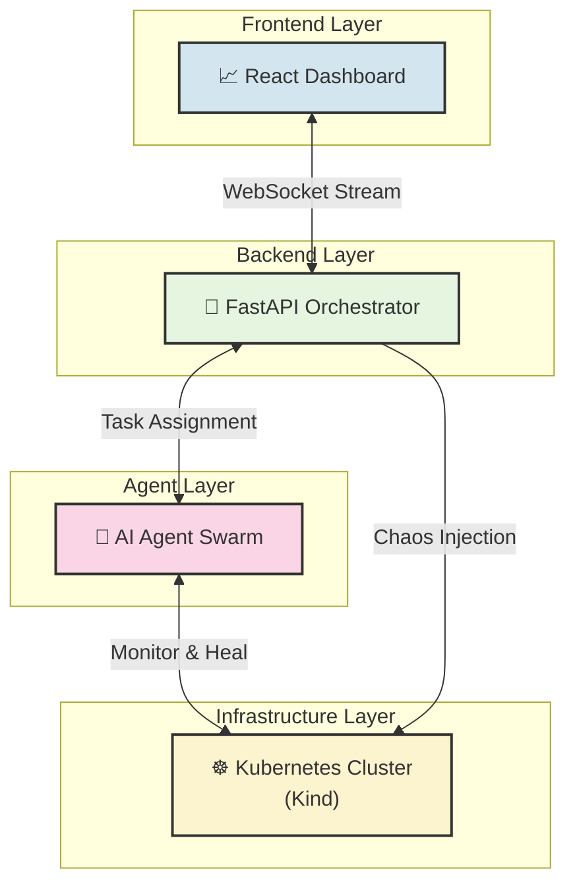
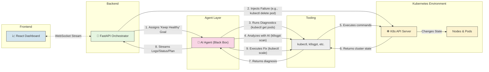
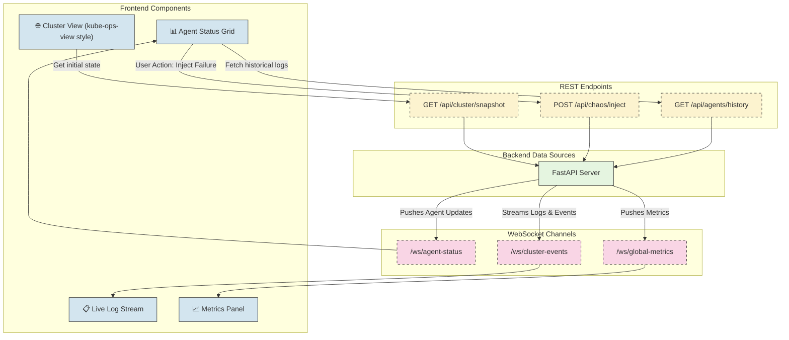

# Agentic Kubernetes Operator Demo

This repository provides the complete environment to demonstrate an AI-based agentic operator managing a Kubernetes cluster. The system uses Kind (Kubernetes in Docker) to simulate a multi-node environment, injects failures using chaos engineering principles, and visualizes the AI agents' response in real-time.

## 🏛️ System Architecture Overview

The architecture is designed in three layers: the **Frontend Dashboard** (our window into the system), the **Backend Orchestrator** (the brains of the operation), and the **Kubernetes Cluster** (the environment being managed). AI agents act as the hands and eyes within the cluster, orchestrated by the backend.

### Level 1: High-Level System Components

This diagram shows the primary components and their basic relationships. The user interacts with the UI, which is powered by the Backend Orchestrator. The Orchestrator manages a swarm of AI agents, which in turn monitor and interact with the Kubernetes cluster.



### Level 2: Agent & Cluster Interaction Workflow

This level details the workflow. The Orchestrator is the central hub. It injects scripted failures into the Kubernetes Cluster to create scenarios for the agents to solve. It also assigns diagnostic tasks to the AI Agent Swarm. Each agent uses standard Tooling (kubectl, k8sgpt) to interact with the Kubernetes API, diagnose issues, and perform corrective actions. The agent's findings and actions are streamed back to the Orchestrator.



### Level 3: Data Endpoints for Frontend Dashboard

This diagram focuses specifically on the data contract between the backend and the frontend. The dashboard is a "dumb" client that renders state provided by the FastAPI server. Communication is primarily handled via WebSockets for real-time updates, with auxiliary data fetched via standard REST APIs.



## 🏗️ Kubernetes Cluster Architecture

The demo cluster includes:
- **1 Control Plane Node** with ingress capabilities
- **4 Worker Nodes** with different labels and roles:
  - Frontend tier (zone: us-west-1a)
  - Backend tier (zone: us-west-1b) 
  - Database tier (zone: us-west-1c)
  - Cache tier (zone: us-west-1a)

## 📋 Prerequisites

Before running this demo, ensure you have the following installed:

### Docker
- [Docker](https://docs.docker.com/get-docker/) - Must be running

### Kind (Kubernetes in Docker)

**macOS:**
```bash
brew install kind
```

**Linux:**
```bash
# For AMD64 / x86_64
[ $(uname -m) = x86_64 ] && curl -Lo ./kind https://kind.sigs.k8s.io/dl/v0.20.0/kind-linux-amd64
# For ARM64
[ $(uname -m) = aarch64 ] && curl -Lo ./kind https://kind.sigs.k8s.io/dl/v0.20.0/kind-linux-arm64
chmod +x ./kind
sudo mv ./kind /usr/local/bin/kind
```

**Windows:**
```powershell
# Using Chocolatey
choco install kind

# Or download binary directly
curl.exe -Lo kind-windows-amd64.exe https://kind.sigs.k8s.io/dl/v0.20.0/kind-windows-amd64
Move-Item .\kind-windows-amd64.exe c:\some-dir-in-your-PATH\kind.exe
```

### kubectl

**macOS:**
```bash
brew install kubectl
```

**Linux:**
```bash
curl -LO "https://dl.k8s.io/release/$(curl -L -s https://dl.k8s.io/release/stable.txt)/bin/linux/amd64/kubectl"
chmod +x kubectl
sudo mv kubectl /usr/local/bin/
```

**Windows:**
```powershell
# Using Chocolatey
choco install kubernetes-cli

# Or using PowerShell
curl.exe -LO "https://dl.k8s.io/release/v1.28.0/bin/windows/amd64/kubectl.exe"
# Move kubectl.exe to a directory in your PATH
```

## 🚀 Quick Start

### 1. Create the Cluster
```bash
chmod +x setup-cluster.sh
./setup-cluster.sh
```

This will:
- Create a 5-node Kind cluster with the specified configuration
- Install NGINX Ingress Controller
- Install Metrics Server for monitoring
- Set up the cluster context

### 2. Deploy Demo Applications
```bash
chmod +x deploy-demo-apps.sh
./deploy-demo-apps.sh
```

This deploys:
- **Frontend**: 3 NGINX replicas in `frontend` namespace
- **Backend**: 4 Apache replicas in `backend` namespace  
- **Database**: 2 Redis StatefulSet replicas in `database` namespace
- **Cache**: 2 Memcached replicas in `backend` namespace
- **CPU Stress**: Load testing application
- **HPA**: Horizontal Pod Autoscaler for backend (2-8 replicas)

### 3. Run Chaos Scenarios
```bash
chmod +x chaos-scenarios.sh
./chaos-scenarios.sh
```

Interactive menu with scenarios:
1. **Pod Failure Simulation** - Randomly kill pods
2. **Node Drain Simulation** - Drain worker nodes
3. **Resource Pressure** - Create CPU/Memory stress
4. **Network Partition** - Block cross-namespace communication
5. **Storage Failure** - Simulate database outages
6. **Rolling Update Failure** - Deploy bad container images
7. **Cascading Failure** - Multi-system failure simulation
8. **Recovery Demonstration** - Restore all services
9. **Show Current Status** - Display cluster health

## 🧹 Cleanup

To remove the entire cluster and clean up resources:
```bash
chmod +x cleanup.sh
./cleanup.sh
```

## 📊 Monitoring Commands

```bash
# View cluster status
kubectl get nodes -o wide
kubectl get pods --all-namespaces

# Monitor resource usage
kubectl top nodes
kubectl top pods --all-namespaces

# Check autoscaling
kubectl get hpa --all-namespaces

# View services
kubectl get services --all-namespaces

# Check ingress
kubectl get ingress --all-namespaces
```

## 🎯 Demo Scenarios

### Basic Pod Resilience
1. Kill frontend pods and watch them recover
2. Scale applications up/down
3. Observe HPA behavior under load

### Node Failure Simulation
1. Drain a worker node
2. Watch pods reschedule to healthy nodes
3. Demonstrate node recovery

### Resource Exhaustion
1. Create CPU/Memory pressure
2. Observe pod evictions
3. Watch cluster auto-scaling responses

### Network Issues
1. Apply network policies
2. Simulate network partitions
3. Demonstrate service mesh behavior

### Storage Failures
1. Scale down StatefulSets
2. Simulate persistent volume issues
3. Test backup/recovery procedures

## 🔧 Customization

### Modify Cluster Configuration
Edit `kind-cluster-config.yaml` to:
- Add more nodes
- Change node labels
- Modify networking settings
- Add custom port mappings

### Add More Applications
Extend `deploy-demo-apps.sh` to include:
- Additional microservices
- Different database types
- Monitoring stack (Prometheus, Grafana)
- Service mesh (Istio, Linkerd)

### Create Custom Chaos Scenarios
Modify `chaos-scenarios.sh` to add:
- Custom failure patterns
- Specific application failures
- Time-based scenarios
- Automated recovery procedures

## 📁 File Structure

```
├── kind-cluster-config.yaml    # Kind cluster configuration
├── setup-cluster.sh           # Cluster creation script
├── deploy-demo-apps.sh        # Application deployment script
├── chaos-scenarios.sh         # Chaos engineering scenarios
├── cleanup.sh                 # Cleanup script
└── README.md                  # This file
```

## 🤝 Sharing and Replication

This entire setup is designed to be easily shared and replicated:

1. **Clone this repository**
2. **Run the setup script** - `./setup-cluster.sh`
3. **Deploy applications** - `./deploy-demo-apps.sh`
4. **Start demonstrating** - `./chaos-scenarios.sh`

The infrastructure as code approach ensures consistent environments across different machines and users.

## 🐛 Troubleshooting

### Common Issues

**Docker not running:**
```bash
# Start Docker Desktop or Docker daemon
open -a Docker
```

**Kind cluster creation fails:**
```bash
# Check Docker resources and try again
kind delete cluster --name=demo-cluster
./setup-cluster.sh
```

**Pods stuck in Pending:**
```bash
# Check node resources and events
kubectl describe nodes
kubectl get events --sort-by=.metadata.creationTimestamp
```

**Metrics not available:**
```bash
# Wait for metrics server to be ready
kubectl get pods -n kube-system | grep metrics-server
```

## 📚 Learning Resources

- [Kind Documentation](https://kind.sigs.k8s.io/)
- [Kubernetes Documentation](https://kubernetes.io/docs/)
- [Chaos Engineering Principles](https://principlesofchaos.org/)
- [kubectl Cheat Sheet](https://kubernetes.io/docs/reference/kubectl/cheatsheet/)

## 🎉 Happy Demoing!

This environment provides a realistic Kubernetes setup for demonstrating resilience patterns, failure scenarios, and recovery procedures. Perfect for training, workshops, and proof-of-concepts.
